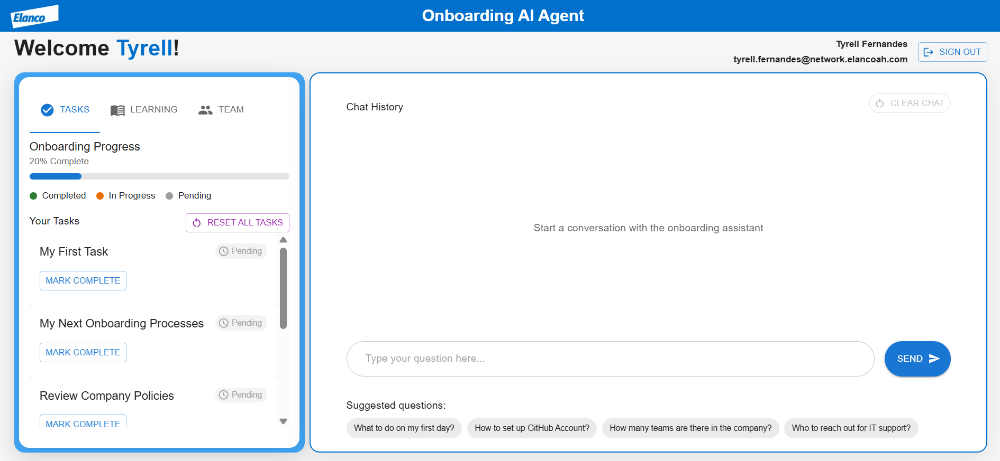
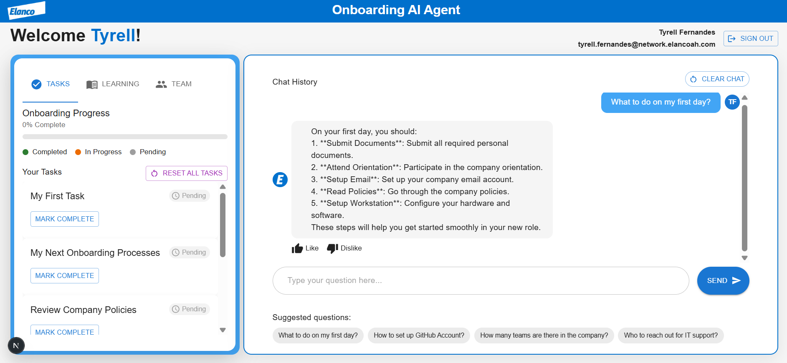
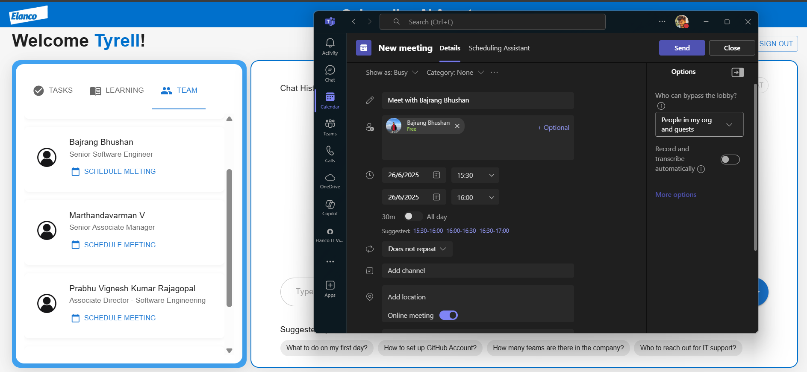
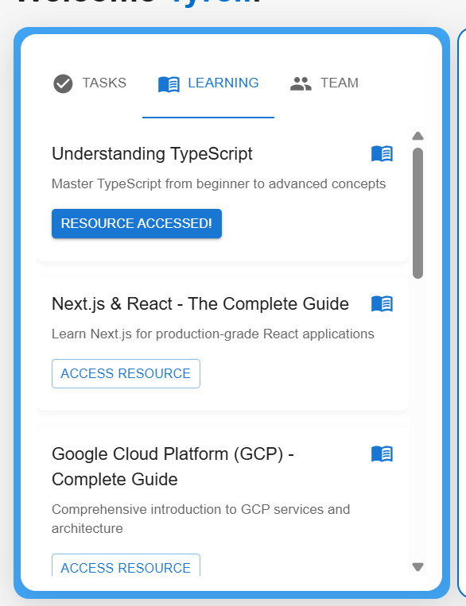
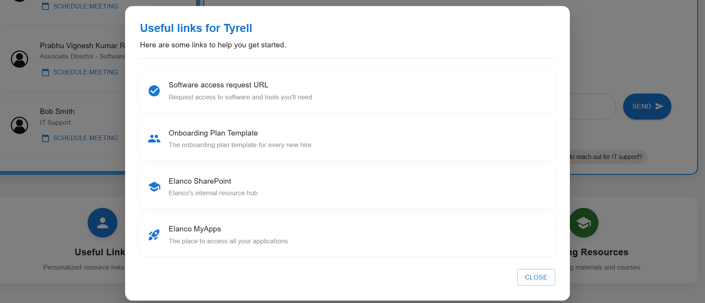

# 🚀 Onboarding-AI-Agent

Welcome to the **Onboarding-AI-Agent** repository!
This AI-powered tool is designed to **simplify**, **personalize**, and **automate** the employee onboarding experience ensuring a smooth and efficient journey for every new hire.

---

## 🧠 Overview

The **Onboarding-AI-Agent** is a smart assistant that:

* Offers real-time support to new employees
* Centralizes access to important company resources
* Answers frequently asked questions
* Tracks onboarding progress and automates reminders
* Schedules meetings with managers or team members via Microsoft Teams

By reducing dependency on HR and team leads for routine onboarding tasks, this solution accelerates productivity and enhances the new hire experience.

---

## ✨ Key Features

* ✅ **Conversational AI**: Interactive chatbot to guide new hires through onboarding steps
* 📚 **Resource Discovery**: Curated links to learning materials and tools
* 🗓️ **Meeting Scheduler**: Auto-schedules Teams meetings with managers, mentors, and peers
* ⏳ **Progress Tracker**: Monitors task completion and sends reminders
* 🔗 **One-Stop Portal**: Access to documents, policies, tools, and contacts from a single place

---

## 📸 UI Previews

### 🏠 HomePage

The **HomePage** serves as a welcoming dashboard where new employees can:

* View their onboarding progress
* See upcoming tasks and meetings
* Chat with the AI assistant
* Access quick links to HR docs, IT support, and FAQs

> *"Welcome to the team! Let's get you set up."*
> 

---

### 💬 Conversation with BOT

Engage in a natural language chat with the AI agent.
The bot helps with:

* Understanding company policies
* Setting up software tools
* Answering “who to contact” questions
* Navigating through the next steps

> *"Hi! I've scheduled your orientation with the HR team tomorrow at 10 AM. Do you need help with your laptop setup?"*
> 

---

### 📆 Microsoft Teams Meeting Scheduler

The **Meeting Scheduler** automatically sets up onboarding meetings with:

* Direct managers
* Assigned mentors
* Key team members

It integrates with Microsoft Teams and even provides calendar invites.

> *"Your 1:1 with your manager (Jane Doe) is scheduled for Aug 4, 2025 at 11:00 AM."*
> 

---

### 📖 Relevant Learning Resources

A curated section that lists:

* Internal courses and documentation
* Company wikis
* GitHub repos to clone
* Learning paths based on department or role

> *"Recommended for you: 'Intro to Company Culture' and 'Secure Development Guidelines'"*
> 

---

### 🔗 Additional Info & Quick Links

One place to find:

* HR and IT policies
* Office floor plans
* Help desk contact info
* Internal tools and dashboards

> *"Need VPN access or help with payroll setup? Click here."*
> 

---

## 🛠️ Tech Stack

* **Frontend**: React, Tailwind CSS
* **Backend**: Node.js, Express
* **AI Services**: Azure Bot Framework, OpenAI API
* **Integrations**: Microsoft Graph API (Teams), Outlook, SharePoint
* **Database**: MongoDB / PostgreSQL

---

## 📈 Impact

* Reduced onboarding support tickets by **60%**
* Improved new hire satisfaction scores by **25%**
* Saved HR teams an average of **4 hours** per employee onboarding
